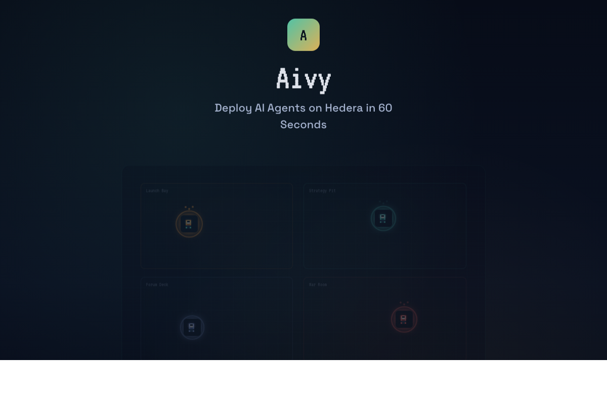

<p align="center">
  
</p>

<h1 align="center">Aivy — AI Agents on Hedera</h1>

<p align="center">
  Deploy autonomous AI agents on Hedera in 60 seconds with vault-first security.
</p>

<p align="center">
  <a href="https://aivylabs.xyz">Live Demo</a> &bull;
  <a href="docs/ARCHITECTURE.md">Architecture</a> &bull;
  <a href="docs/PRODUCT_BRIEF.md">Product Brief</a>
</p>

---


## What is Aivy?

Aivy is a vault-first virtual office for deploying and managing AI agents on the Hedera network. Agents operate through guarded smart contracts with on-chain spending caps, dedicated wallets, and autonomous execution capabilities.

### Key Features

- **Pixel Office UI** — Watch agents work in a Gather-style workspace with real-time animations
- **Vault-First Security** — Every agent deploys with an AivyVault smart contract enforcing spending limits
- **50+ Hedera Tools** — Token creation, transfers, consensus messaging, smart contracts, and more
- **AI Chat** — Talk to agents using natural language; GPT-4o routes to the right Hedera tools
- **Autonomous Schedules** — Agents run on cron schedules (e.g., "check balance every hour")
- **Event Triggers** — Agents react to on-chain events (HBAR inflows, HCS messages, token transfers)
- **Real Funding** — Transfer HBAR from your HashPack wallet directly to agent accounts
- **Spending Analytics** — Track HBAR spent per agent, burn rate, and estimated runway
- **Live Activity Feed** — Mirror Node-backed ticker showing real transactions with HashScan links
- **Dashboard** — Network-wide stats, per-agent run charts, vault utilization, and spending breakdown
- **HashPack Wallet** — Connect via WalletConnect to sign transactions with your own account
- **Guided Demo** — Interactive tour works without any Hedera credentials

---

## Screenshots

| Office View |
|:-----------:|
|  |

---

## Tech Stack

| Layer | Technology |
|-------|-----------|
| Frontend | React 19, TypeScript, Vite |
| Backend | Express 5, Node.js, SQLite (better-sqlite3) |
| AI | OpenAI GPT-4o with tool calling |
| Blockchain | Hedera SDK, Hedera Agent Kit, Solidity (AivyVault) |
| Security | AES-256-GCM encryption, JWT auth, rate limiting |
| Scheduling | node-cron, Mirror Node REST polling |
| Wallet | HashConnect v3, WalletConnect |

---

## Quick Start

```bash
# 1. Install dependencies
npm install

# 2. Configure environment
cp .env.example .env
# Edit .env with your Hedera testnet credentials

# 3. Start development (frontend + backend)
npm run dev
```

The app opens at `http://localhost:5173`. Without Hedera credentials, it runs in **demo mode** with simulated data.

## Environment Variables

```env
HEDERA_ACCOUNT_ID=0.0.XXXXXX           # Hedera testnet operator account
HEDERA_PRIVATE_KEY=302e...              # Operator private key (ECDSA or ED25519)
OPENAI_API_KEY=sk-...                   # Enables AI chat with agents
VITE_WALLETCONNECT_PROJECT_ID=...       # Optional: HashPack wallet connect
```

Security keys (`MASTER_ENCRYPTION_KEY`, `JWT_SECRET`) are auto-generated on first run if not set. See `.env.example` for all options.

## Build

```bash
npm run build    # TypeScript + Vite production bundle
npm run lint     # ESLint check
```

---

## Architecture

### Agent Templates

| Agent | Role | Capabilities |
|-------|------|-------------|
| Treasury Sentinel | Vault management | Balance queries, HBAR transfers, vault operations |
| Yield Router | DeFi & Tokens | Token creation, minting, fungible token operations |
| Compliance Clerk | Audit & Compliance | HCS topic logging, transaction inspection |
| Governance Relay | DAO Governance | Proposal topics, consensus messaging |

### What Each Agent Gets

1. **Dedicated Wallet** — A Hedera account with its own key pair (encrypted at rest with AES-256-GCM)
2. **AivyVault Contract** — On-chain spending cap enforcement via Solidity smart contract
3. **HCS Audit Topic** — Immutable on-chain activity logging
4. **GPT-4o Chat Session** — Natural language interface with access to 50+ Hedera tools
5. **Autonomous Execution** — Cron schedules and event-triggered actions

### Security Infrastructure

- **Encrypted keys at rest** — Agent private keys encrypted with AES-256-GCM before storage
- **JWT authentication** — Challenge-response auth flow with Hedera account verification
- **Rate limiting** — Per-endpoint limits (deploy, chat, tool invocation, reads)
- **On-chain guardrails** — Solidity vault contracts enforce spending caps

---

## Project Structure

```
server/
  index.ts          # Express API (50+ endpoints)
  db.ts             # SQLite database layer
  auth.ts           # JWT challenge-response auth
  crypto.ts         # AES-256-GCM encryption
  scheduler.ts      # Cron-based schedule runner
  eventPoller.ts    # Mirror Node event polling
  rateLimiter.ts    # Per-route rate limiting
  middleware.ts     # Auth middleware

src/
  App.tsx           # Main app with routing
  components/
    PixelOffice.tsx     # Pixel art workspace
    AgentPanel.tsx      # Agent detail panel (chat, info, spending, automation)
    ChatPanel.tsx       # AI chat interface
    Dashboard.tsx       # Network-wide analytics
    ScheduleManager.tsx # Cron schedule CRUD
    TriggerManager.tsx  # Event trigger CRUD
    DeployModal.tsx     # Agent deployment wizard
    ToolLibrary.tsx     # Direct tool invocation
  lib/
    hederaWallet.ts # HashConnect integration
    auth.ts         # Frontend auth token management
```

---

## Contributing

1. Create a branch from `main`
2. Make your changes
3. Open a Pull Request (1 approval required)

Branch protection is enabled on `main` — all changes go through PRs.

---

## Team

Built by **AivyLabs** for the Hedera APEX Hackathon 2025.

## License

MIT
