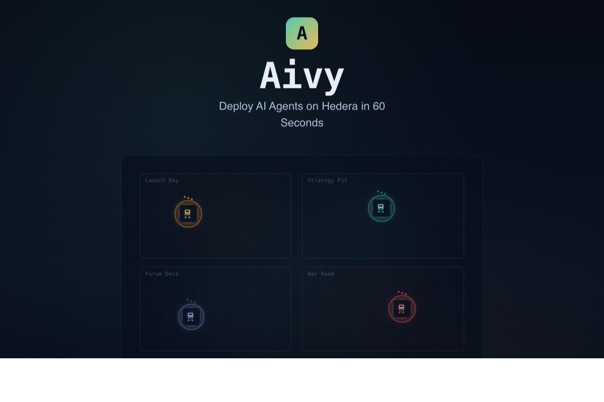

<p align="center">
  
</p>

<h1 align="center">Aivy — AI Agents on Hedera</h1>

<p align="center">
  The missing infrastructure layer for autonomous AI agents on Hedera.<br/>
  Deploy, fund, schedule, and monitor agents that interact with the Hedera network — in 60 seconds.
</p>

<p align="center">
  
  
  
  
</p>

<p align="center">
  <a href="https://aivylabs.xyz">Live Demo</a> &bull;
  <a href="docs/KMS_SECURITY.md">🔐 AWS KMS Security</a> &bull;
  <a href="docs/ARCHITECTURE.md">Architecture</a> &bull;
  <a href="docs/PRODUCT_BRIEF.md">Product Brief</a> &bull;
  <a href="contracts/AivyVault.sol">AivyVault</a> &bull;
  <a href="docs/ERC8183.md">ERC-8183</a>
</p>

---

## 🎛 Aivy Studio

**[studio.aivylabs.xyz](https://studio.aivylabs.xyz)** — the visual canvas for orchestrating multi-agent workflows on Hedera. Think **n8n, but for AI agents**: drag, connect, and activate agent workflows as node graphs.

- **Visual workflows**: agents, HCS-10 communication channels, HTS escrow, smart-contract commitments, and hardware-wallet approval gates as connectable nodes
- **Live on-chain**: activate a flow and watch nodes light up as real Hedera events stream in via mirror node
- **Template library**: ships with [Kickoff.bot](https://kickoff.bot) — a P2P agent-driven negotiation marketplace — as the first production template; load it, modify it, or use it as a starting point for your own agent workflows
- **Source**: [github.com/jmgomezl/aivy-studio](https://github.com/jmgomezl/aivy-studio)

Aivy deploys and secures the agents; Aivy Studio composes them into workflows.



## Why Aivy?

Hedera has world-class infrastructure — fast finality, low fees, native tokens, consensus messaging — but **building agentic applications on top of it is still hard**. Developers need to wire up wallet management, tool calling, transaction guardrails, and execution loops from scratch.

Aivy solves this by providing a **ready-to-use platform where AI agents are first-class citizens on Hedera**:

- **🔐 AWS KMS-protected signing keys** — Every agent's private key is encrypted by a dedicated AWS KMS symmetric key. Keys are **never stored in plaintext** — decrypted in-memory only for the milliseconds needed to sign, then wiped. Full CloudTrail audit trail. ([Details →](docs/KMS_SECURITY.md))
- **Any LLM can operate on Hedera** — Agents use 50+ tools from the Hedera Agent Kit via natural language. No SDK knowledge required.
- **Agents run autonomously, not just on user prompts** — Cron schedules and on-chain event triggers let agents act on their own (e.g., "rebalance treasury weekly", "respond to incoming HBAR transfers").
- **On-chain guardrails, not just promises** — Every agent deploys with an [AivyVault](contracts/AivyVault.sol) Solidity contract that enforces spending caps at the EVM level. The AI literally cannot overspend.
- **Real wallet isolation** — Each agent gets its own Hedera account with a KMS-encrypted private key. No shared operator key risk.
- **Hedera-native event system** — Agents react to HBAR transfers, HCS topic messages, and token movements by polling the Mirror Node in real-time.

> **The goal**: make it as easy to deploy an autonomous Hedera agent as it is to deploy a serverless function.

---

## Hedera Integration Deep Dive

### Hedera Agent Kit — 50+ On-Chain Tools

Aivy wraps the full [Hedera Agent Kit](https://github.com/hashgraph/hedera-agent-kit) and exposes every tool to AI agents via OpenAI function calling:

| Capability Group | Hedera Operations | Example Agent Use |
|-----------------|-------------------|-------------------|
| **Accounts** | `create_account`, `transfer_hbar`, `get_account_balance` | Treasury Sentinel checks balances and moves HBAR |
| **Tokens (HTS)** | `create_token`, `mint_token`, `transfer_token`, `associate_token` | Yield Router mints reward tokens |
| **Consensus (HCS)** | `create_topic`, `submit_message`, `get_topic_messages` | Compliance Clerk logs audit records immutably |
| **Smart Contracts** | `deploy_contract`, `call_contract`, `get_contract_info` | Deploy AivyVault guardrail contracts |
| **Queries** | `get_transaction_record`, `get_account_info`, `get_exchange_rate` | Any agent inspects on-chain state |

Agents are granted **capability groups**, not individual tools — so a read-only Compliance Clerk can never accidentally mint tokens.

### AivyVault — On-Chain Spending Guardrails

Every vault-protected agent deploys an [`AivyVault.sol`](contracts/AivyVault.sol) smart contract on Hedera:

```solidity
// Enforces per-agent spending caps at the EVM level
function logExecution(string action, uint256 amountTinybar, ...) external onlyOwner {
    require(!paused, "vault paused");
    require(amountTinybar <= spendingCapTinybar, "cap exceeded");
    emit ExecutionLogged(action, amountTinybar, targetAccountId, note);
}
```

This means spending limits are enforced **on-chain**, not just in application code. Even if the AI hallucinates a large transfer, the vault contract blocks it. The contract also supports:

- **Guardrail updates** — Owner can adjust spending caps and pause state
- **Provisioning events** — `VaultProvisioned` emitted on deployment for audit trail
- **Receive fallback** — Contract can hold HBAR for agent operations
- **ERC-8183 integration** — Vault caps are checked before agents can fund [agent-to-agent jobs](docs/ERC8183.md)

### 🔐 AWS KMS — Secure Key Management

> **Bounty**: Secure Key Management for Onchain Applications (Intermediate)

Every agent deployed on Aivy is protected by **AWS KMS envelope encryption**. Private keys never exist in plaintext at rest — they're encrypted by a dedicated KMS symmetric key per agent.

```
┌──────────────────┐     ┌──────────────────┐     ┌──────────────────┐
│   Agent Deploys   │────▶│  AWS KMS Creates  │────▶│  Hedera Account   │
│   (UI / API)      │     │  Symmetric Key    │     │  Created On-Chain │
└──────────────────┘     └──────────────────┘     └──────────────────┘
                                   │
                          encrypts private key
                                   │
                                   ▼
                         ┌──────────────────┐
                         │  SQLite stores    │
                         │  ciphertext only  │
                         │  (never plaintext)│
                         └──────────────────┘
```

**Transaction signing flow:**

1. Agent needs to sign → KMS `Decrypt` API call (TLS 1.3)
2. Private key exists in memory for **< 50ms**
3. Transaction signed with Hedera SDK
4. Key buffer wiped with `Buffer.fill(0)`
5. Every KMS operation logged in **AWS CloudTrail**

**Key features:**

| Feature | Description |
|---------|-------------|
| **Per-Agent KMS Keys** | Each agent gets its own dedicated KMS symmetric key |
| **Envelope Encryption** | Hedera Ed25519 key encrypted with KMS AES-256 |
| **Auto-Rotation** | KMS keys rotate annually via `EnableKeyRotation` |
| **Key Lifecycle** | Create → Encrypt → Rotate → Schedule Deletion (7-day safety) |
| **Encryption Context** | Decrypt requires matching `{platform, agent, keyType}` |
| **Migration Support** | Existing plaintext keys can be migrated to KMS |
| **Graceful Fallback** | Without AWS credentials, falls back to AES-256-GCM local encryption |

**API endpoints:**

```
GET  /api/kms/status              # Check if KMS is active
GET  /api/agents/:id/kms/info     # Get KMS key metadata for agent
POST /api/agents/:id/kms/rotate   # Rotate agent's Hedera key
```

📖 **[Full KMS Security Documentation →](docs/KMS_SECURITY.md)**

---

### Mirror Node Event Polling

Aivy polls the Hedera Mirror Node REST API every 30 seconds to detect:

- **HBAR inflows** — Transfers landing in an agent's account (with configurable minimum amount)
- **HCS messages** — New messages on any topic the agent monitors
- **Token transfers** — Fungible/NFT tokens arriving at the agent's account

When an event matches a trigger, Aivy fills a prompt template with event data (`{{amount}}`, `{{sender}}`, `{{txId}}`) and runs the agent autonomously.

### HashPack Wallet Integration

Users connect their HashPack wallet via WalletConnect/HashConnect v3 to:

- **Fund agent accounts** — Direct HBAR transfer from user wallet to agent's dedicated Hedera account via quick-fund presets (1/5/10/25 HBAR)
- **Authenticate** — Challenge-response flow: server issues a challenge, user signs with their Hedera key, server verifies via Mirror Node
- **Track spending** — Real-time balance monitoring via Mirror Node with 30-second auto-refresh

---

## Screenshots


---

## Key Features

| Feature | Description |
|---------|-------------|
| **Pixel Office** | Visual workspace with animated pixel sprites, themed rooms, and live agent movement |
| **Quick Fund** | Fund agents in 2 clicks — select agent, pick preset amount, sign in wallet |
| **Autonomous Schedules** | Cron-based execution — "check balance every hour", "rebalance weekly" |
| **Event Triggers** | React to HBAR inflows, HCS messages, token transfers via Mirror Node |
| **Real Funding Flow** | Transfer HBAR from HashPack directly to agent accounts |
| **Spending Analytics** | Per-agent HBAR tracking, burn rate, estimated runway |
| **🔐 AWS KMS Keys** | Every agent's signing key encrypted by a dedicated KMS key — never stored in plaintext ([docs](docs/KMS_SECURITY.md)) |
| **Vault Guardrails** | [AivyVault.sol](contracts/AivyVault.sol) enforces spending caps on-chain |
| **50+ Hedera Tools** | Full Agent Kit: accounts, tokens, consensus, contracts, queries |
| **AI Chat** | Natural language interface — GPT-4o routes to the right Hedera tools |
| **Multi-Agent Routing** | Ask a question, Aivy picks the best agent to answer |
| **Agent Coordination** | Agents trigger actions on other agents (e.g., low balance alerts) |
| **ERC-8183 Settlements** | [AivyJobManager.sol](contracts/AivyJobManager.sol) — trustless agent-to-agent payments with escrow ([docs](docs/ERC8183.md)) |
| **Live Activity Feed** | Mirror Node-backed ticker with HashScan transaction links |
| **Global Wallet State** | WalletContext provides batch balance pre-fetching and 30s auto-refresh |
| **Mobile Support** | Touch-friendly with long-press hover cards, responsive layout |

---

## Tech Stack

| Layer | Technology |
|-------|-----------|
| Frontend | React 19, TypeScript, Vite |
| Office Engine | Pixel sprites with CSS animations, room-based layout |
| Backend | Express 5, Node.js, SQLite (better-sqlite3) |
| AI | OpenAI GPT-4o with function calling |
| Blockchain | Hedera SDK, Hedera Agent Kit, Solidity (AivyVault + AivyJobManager) |
| Smart Contracts | [AivyVault.sol](contracts/AivyVault.sol) + [AivyJobManager.sol](contracts/AivyJobManager.sol) — Solidity ^0.8.24, compiled via solc-js |
| Key Management | AWS KMS envelope encryption, per-agent symmetric keys, CloudTrail audit |
| Security | AES-256-GCM + KMS encryption, JWT auth, rate limiting |
| Automation | node-cron, Mirror Node REST polling |
| Wallet | HashConnect v3, WalletConnect |
| Testing | Vitest, 159+ unit tests |

---

## Quick Start

```bash
# 1. Install dependencies
npm install

# 2. Configure environment
cp .env.example .env
# Edit .env with your Hedera testnet credentials

# 3. Start development (frontend + backend)
npm run dev
```

The app opens at `http://localhost:5173`. Without Hedera credentials, it runs in **demo mode** with simulated data.

### Environment Variables

```env
# Hedera
HEDERA_ACCOUNT_ID=0.0.XXXXXX           # Hedera testnet operator account
HEDERA_PRIVATE_KEY=302e...              # Operator private key (ECDSA or ED25519)

# AWS KMS (enables secure key management)
AWS_ACCESS_KEY_ID=AKIA...               # IAM user with KMS permissions
AWS_SECRET_ACCESS_KEY=...               # IAM secret key
AWS_REGION=us-east-1                    # KMS key region

# AI & Wallet
OPENAI_API_KEY=sk-...                   # Enables AI chat with agents
VITE_WALLETCONNECT_PROJECT_ID=...       # Optional: HashPack wallet connect
```

Security keys (`MASTER_ENCRYPTION_KEY`, `JWT_SECRET`) are auto-generated on first run if not set. When AWS KMS credentials are provided, agent keys are encrypted via KMS; otherwise falls back to local AES-256-GCM.

### Build & Test

```bash
npm run build    # TypeScript + Vite production bundle
npm run lint     # ESLint check
npm test         # Run 159+ unit tests via Vitest
```

---

## Architecture

### Agent Templates

| Agent | Hedera Role | Capability Groups |
|-------|------------|-------------------|
| Treasury Sentinel | HBAR management | Accounts, Account Queries, Consensus, Transaction Queries |
| Yield Router | Token & DeFi ops | Accounts, Tokens, Token Queries, Contracts, Contract Queries |
| Compliance Clerk | Audit & read-only | All Query groups (no mutations) |
| Governance Relay | DAO proposals | Consensus, Consensus Queries, Network Queries |

### What Each Agent Gets

1. **Dedicated Hedera Account** — Own key pair, encrypted by a dedicated AWS KMS key (never stored in plaintext)
2. **AWS KMS Key** — Per-agent symmetric key for envelope encryption with CloudTrail audit trail
3. **AivyVault Contract** — On-chain spending cap enforcement via [Solidity](contracts/AivyVault.sol)
4. **HCS Audit Topic** — Every action logged immutably on Hedera Consensus Service
5. **GPT-4o Session** — Natural language with access to 50+ Hedera tools
6. **Autonomous Execution** — Cron schedules + event-triggered actions via Mirror Node

### Agent Deployment Flow (KMS + Vault)

```
Deploy Agent
    │
    ├──▶ AWS KMS: CreateKey (symmetric, per-agent)
    │       └──▶ Generate Ed25519 keypair
    │       └──▶ KMS Encrypt private key → store ciphertext in DB
    │       └──▶ Enable auto-rotation
    │
    ├──▶ Hedera: Create dedicated account (signed with KMS-decrypted key)
    │
    ├──▶ Compile AivyVault.sol (solc-js, server-side)
    │       └──▶ ContractCreateFlow → deploy to Hedera EVM
    │       └──▶ Store contract ID in DB
    │
    └──▶ Agent ready: KMS-protected key + on-chain vault guardrails
```

---

## Project Structure

```
contracts/
  AivyVault.sol         # On-chain spending guardrails (Solidity ^0.8.24)
  AivyJobManager.sol    # ERC-8183 agent-to-agent settlements with escrow

server/
  index.ts              # Express API — agents, chat, tools, schedules, triggers, jobs
  kms.ts                # 🔐 AWS KMS integration — key creation, encryption, rotation, deletion
  db.ts                 # SQLite — deployments, spending, schedules, triggers, jobs
  auth.ts               # JWT challenge-response with Hedera account verification
  crypto.ts             # AES-256-GCM encryption (additional layer on top of KMS)
  scheduler.ts          # node-cron wrapper for autonomous agent execution
  eventPoller.ts        # Mirror Node polling for HBAR, HCS, token events
  rateLimiter.ts        # Per-route rate limiting
  middleware.ts         # Auth middleware

src/
  contexts/
    WalletContext.tsx    # Global wallet state, batch balance pre-fetching
  components/
    PixelOffice.tsx      # Office grid with themed rooms and agent sprites
    AgentSprite.tsx      # Animated pixel sprites with hover cards, fund chip
    AgentPanel.tsx       # Agent detail — chat, info, spending, automation tabs
    FundModal.tsx        # Quick-fund modal with preset amounts
    ChatPanel.tsx        # AI chat with Hedera tool calling
    DeployModal.tsx      # Agent deployment wizard
    ScheduleManager.tsx  # Cron schedule CRUD UI
    TriggerManager.tsx   # Event trigger CRUD UI
    Dashboard.tsx        # Network-wide analytics
    ToolLibrary.tsx      # Direct Hedera tool invocation
    Landing.tsx          # Landing page with vault architecture showcase
  sprites/
    generateSprites.ts   # Pixel art sprite sheet generator
  hooks/
    useWallet.ts         # HashConnect v3 wallet hook
    useLiveData.ts       # Live agent data polling
    useAgentMovement.ts  # Agent position animation
  lib/
    hederaWallet.ts      # HashConnect v3 integration
    auth.ts              # Client-side auth helpers

tests/
  client/               # Frontend unit tests
  server/               # Backend unit tests
```

---

## Contributing

1. Create a branch from `main`
2. Make your changes
3. Run `npm test` and `npm run build`
4. Open a Pull Request (1 approval required)

Branch protection is enabled — all changes go through PRs.

---

## Community Contributions

> **Note:** These contributions were made during the APEX Hackathon development period. No changes have been made to the deployed Aivy platform (aivylabs.xyz) after the hackathon submission deadline.

During the development of Aivy, we identified issues and contributed back to the Hedera ecosystem tools we depend on:

- **[hashgraph/hedera-agent-kit-js#614](https://github.com/hashgraph/hedera-agent-kit-js/issues/614)** — Reported stale balance reads from `AccountBalanceQuery` on testnet after `CryptoTransfer`. The SDK returns outdated balances for several minutes while the mirror node reflects the correct value immediately. Suggested a mirror node fallback for balance queries.

- **SaucerSwap Plugin** — Identified that the `hak-saucerswap-plugin` does not support API key authentication, which is now required by the SaucerSwap REST API. Built a workaround and documented the fix for an upstream PR.

We are active Hedera Developer Ambassadors and Agent Kit plugin contributors, and we plan to continue contributing to the ecosystem beyond this hackathon.

---

## Team

Built by **AivyLabs** for the Hedera APEX Hackathon 2026.

🏆 **3rd Place — AI & Agents category** · [APEX Hackathon Winners](https://hedera.com/blog/these-are-the-winners-of-the-hello-future-apex-hackathon/)

## License

MIT
