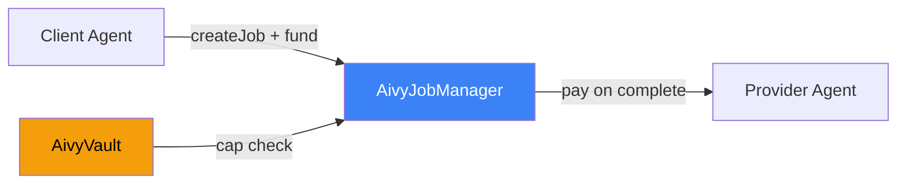
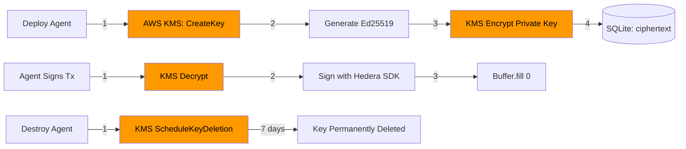

# Architecture

## System overview

Aivy is a monorepo with a React frontend and Express backend that orchestrates AI agents on Hedera testnet:

- **Frontend**: Pixel office UI with animated sprites, deployment console, AI chat, and wallet integration.
- **Backend**: Express API handling agent lifecycle, AI tool calling, scheduling, and event polling.
- **Vault layer**: AivyVault Solidity contracts deployed on Hedera EVM for on-chain spending guardrails.
- **Key management layer**: AWS KMS envelope encryption — each agent's private key is encrypted by a dedicated KMS symmetric key. Keys are never stored in plaintext.
- **Data layer**: SQLite for agent state, Mirror Node for on-chain data, and AES-256-GCM for application-layer encryption.

## Core principle

Agents should not receive unrestricted token access by default.

Instead:

1. An AivyVault contract is deployed on Hedera EVM.
2. Spending cap rules are encoded in the contract constructor.
3. The agent receives execution permissions scoped by those rules.
4. Every action is logged on-chain via `ExecutionLogged` events and on HCS audit topics.

## Logical components

### 1. Pixel Office frontend

Responsibilities:

- Visual workspace with themed rooms (Launch Bay, Strategy Pit, Forum Deck, War Room).
- Animated pixel sprites with status indicators, speech bubbles, and hover info cards.
- Agent deployment flow with template selection and vault configuration.
- Quick-fund modal with preset amounts (1/5/10/25 HBAR) via HashPack.
- Real-time balance display via Mirror Node with 30-second auto-refresh.
- Activity feed with HashScan transaction links.
- AI chat with multi-agent routing.

Stack:

- React 19 with TypeScript and Vite.
- WalletContext for global wallet state and batch balance pre-fetching.
- HashConnect v3 for HashPack wallet integration.
- CSS animations for sprite movement and UI transitions.

### 2. Backend API

Responsibilities:

- Agent lifecycle management (deploy, pause, resume, delete).
- AI chat routing via OpenAI GPT-4o with 50+ Hedera Agent Kit tools.
- AivyVault contract compilation (solc-js) and deployment (ContractCreateFlow).
- Cron schedule management via node-cron.
- Event trigger polling via Mirror Node REST API.
- JWT authentication with Hedera account verification.

Key endpoints:

- `POST /api/agents/deploy` — Deploy agent with Hedera account + vault contract.
- `POST /api/agents/:id/chat` — AI chat with tool calling.
- `POST /api/agents/:id/fund` — Record funding transaction.
- `GET /api/agents/:id/spending` — Spending analytics.
- `CRUD /api/agents/:id/schedules` — Cron schedule management.
- `CRUD /api/agents/:id/triggers` — Event trigger management.

### 3. AivyVault contract layer

The AivyVault contract ([`contracts/AivyVault.sol`](../contracts/AivyVault.sol)) provides:

- **Spending caps** — `spendingCapTinybar` enforced on every `logExecution()` call.
- **Pause control** — Owner can pause/unpause the vault.
- **Policy labels** — Human-readable policy descriptions stored on-chain.
- **Audit events** — `VaultProvisioned`, `GuardrailsUpdated`, `ExecutionLogged`.

Deployment flow:

```
Template selected → solc-js compiles AivyVault.sol
                  → ContractCreateFlow deploys to Hedera EVM
                  → Contract ID stored in SQLite alongside agent record
                  → logExecution() called before each tool invocation
```

### 4. ERC-8183 Job Manager

The AivyJobManager contract ([`contracts/AivyJobManager.sol`](../contracts/AivyJobManager.sol)) implements the ERC-8183 Agentic Commerce Protocol for agent-to-agent settlements:

- **Job lifecycle** — Open → Funded → Submitted → Completed/Rejected/Expired.
- **Escrow** — HBAR held in the contract until evaluator approves or rejects.
- **Vault bridge** — AivyVault spending caps are checked before any job is funded.
- **Hooks** — Optional `IACPHook` interface for custom logic on submit/complete.



See [`docs/ERC8183.md`](ERC8183.md) for full documentation with Mermaid diagrams.

### 5. Hedera integration layer

Responsibilities:

- Translate template actions into Hedera Agent Kit tool calls.
- Deploy AivyVault contracts via Hedera SDK.
- Create dedicated agent accounts with encrypted key pairs.
- Create HCS audit topics for immutable action logging.
- Query balances and transactions via Mirror Node REST API.

Integration points:

- **Hedera SDK** — Account creation, HBAR transfers, contract deployment.
- **Hedera Agent Kit** — 50+ tools exposed to AI agents via function calling.
- **Mirror Node** — Balance queries, transaction history, event polling.
- **HashScan** — Transaction links in the activity feed.

### 6. AWS KMS Key Management Layer

> 📖 Full documentation: [KMS_SECURITY.md](KMS_SECURITY.md)

Aivy integrates AWS KMS for secure cryptographic key management. Every agent gets a **dedicated KMS symmetric key** that protects its Hedera signing key via envelope encryption.

**Architecture:**

```
┌─────────────┐    ┌──────────────┐    ┌─────────────────┐
│  Agent needs │───▶│ KMS Decrypt  │───▶│ Sign Hedera Tx  │
│  to sign tx  │    │ (< 50ms)     │    │ Wipe key memory │
└─────────────┘    └──────────────┘    └─────────────────┘
                          │
                   AWS CloudTrail
                   logs every call
```

**Key lifecycle:**

1. **Create** — `CreateKeyCommand` (symmetric AES-256) + tag with agent metadata
2. **Encrypt** — Generate Ed25519 keypair → encrypt private key with KMS → store ciphertext
3. **Sign** — Decrypt in memory → sign transaction → `Buffer.fill(0)` wipe
4. **Rotate** — Generate new keypair → encrypt with same KMS key → update DB
5. **Delete** — `ScheduleKeyDeletion` with 7-day safety window on agent destruction

**Security properties:**

- Private keys never exist in plaintext at rest
- Each agent has its own KMS key (blast radius = 1 agent)
- Encryption context (`{platform, agent, keyType}`) prevents cross-agent decryption
- CloudTrail provides complete audit trail of every key operation
- Auto-rotation enabled on all KMS keys

**Implementation:** [`server/kms.ts`](../server/kms.ts) — 385 lines, 8 exported functions



---

## Current repository structure

```
contracts/
  AivyVault.sol           # On-chain spending guardrails
  AivyJobManager.sol      # ERC-8183 agent-to-agent settlements

server/
  index.ts                # Express API + Hedera integration
  kms.ts                  # 🔐 AWS KMS — key creation, encryption, rotation, deletion
  db.ts                   # SQLite persistence (stores KMS key IDs + ciphertext)
  auth.ts                 # JWT + Hedera account auth
  crypto.ts               # AES-256-GCM encryption (additional layer)
  scheduler.ts            # Cron-based autonomous execution
  eventPoller.ts          # Mirror Node event polling
  rateLimiter.ts          # Per-route rate limiting
  middleware.ts           # Auth middleware

src/
  contexts/
    WalletContext.tsx      # Global wallet state + balance pre-fetch
  components/
    PixelOffice.tsx        # Office grid with rooms
    AgentSprite.tsx        # Animated pixel sprites
    AgentPanel.tsx         # Agent detail panel
    FundModal.tsx          # Quick-fund modal
    ChatPanel.tsx          # AI chat
    DeployModal.tsx        # Deploy wizard
    Landing.tsx            # Landing page
    Dashboard.tsx          # Analytics
    ...
  sprites/
    generateSprites.ts     # Sprite sheet generator
  hooks/
    useWallet.ts           # HashConnect wallet hook
    useLiveData.ts         # Live data polling
    ...
  lib/
    hederaWallet.ts        # HashConnect v3
    auth.ts                # Client auth

tests/                     # 159+ unit tests
  client/
  server/
```

## Security model — Three-Layer Defense-in-Depth

```
┌────────────────────────────────────────────────────────┐
│              Layer 3: AWS KMS                           │
│    Envelope encryption · CloudTrail audit · Rotation    │
│   ┌────────────────────────────────────────────────┐   │
│   │         Layer 2: AivyVault.sol (EVM)            │   │
│   │    On-chain spending caps · Solidity guardrails  │   │
│   │   ┌────────────────────────────────────────┐    │   │
│   │   │     Layer 1: Application Security       │    │   │
│   │   │  JWT · AES-256-GCM · Rate limits · RBAC │    │   │
│   │   └────────────────────────────────────────┘    │   │
│   └────────────────────────────────────────────────┘   │
└────────────────────────────────────────────────────────┘
```

1. **AWS KMS envelope encryption** — Each agent's private key encrypted by a dedicated KMS symmetric key. Keys decrypted in-memory only for signing (< 50ms), then wiped. Full CloudTrail audit. ([Details](KMS_SECURITY.md))
2. **Vault contracts** — On-chain spending caps prevent overspending even if application is compromised.
3. **Capability groups** — Agents only access tools in their assigned groups.
4. **Key encryption at rest** — Application-layer AES-256-GCM on top of KMS encryption.
5. **JWT auth** — Challenge-response with Hedera account verification.
6. **Rate limiting** — Per-route limits to prevent abuse.
7. **User scoping** — Each user sees only their own agents.
