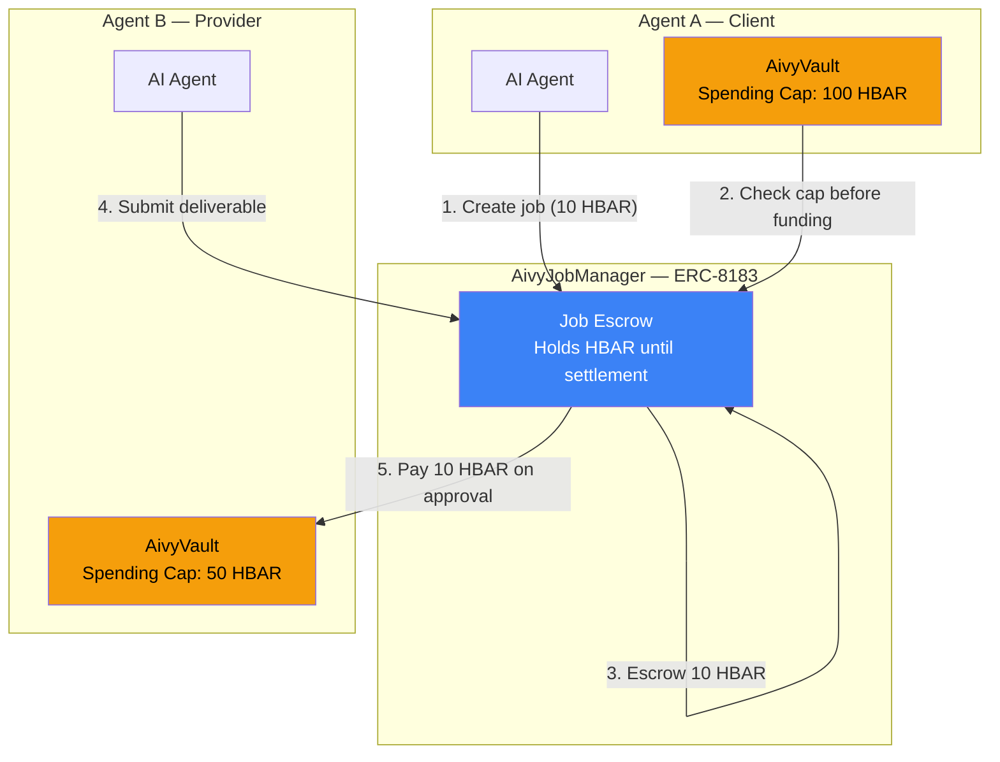
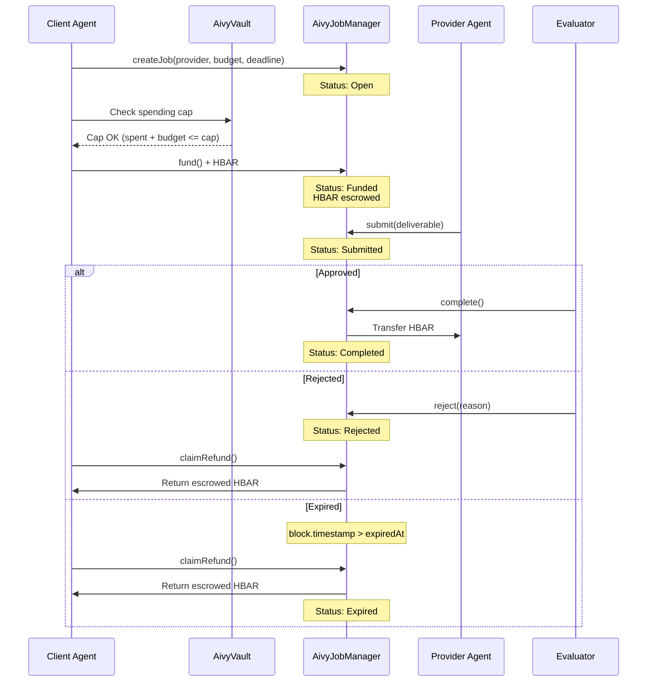
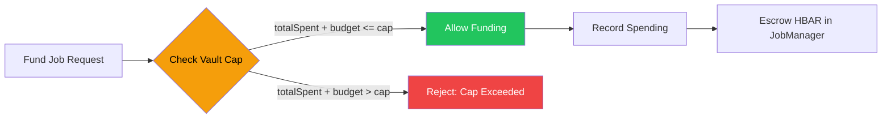
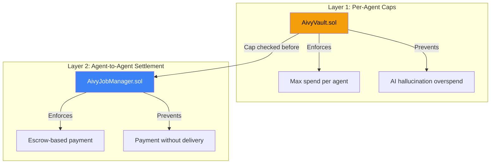

# ERC-8183 — Agentic Commerce Protocol

Aivy implements the ERC-8183 Agentic Commerce Protocol for trustless agent-to-agent settlements on Hedera. This enables agents to create jobs, escrow HBAR, and pay each other upon task completion — all enforced on-chain.

## How It Works

ERC-8183 adds a **settlement layer** on top of AivyVault's spending caps. While AivyVault prevents any single agent from overspending, ERC-8183 enables structured payments between agents through an escrow-based job lifecycle.

### Architecture



### Job Lifecycle



## Smart Contract

**File:** [`contracts/AivyJobManager.sol`](../contracts/AivyJobManager.sol)

### Job Struct

| Field | Type | Description |
|-------|------|-------------|
| id | uint256 | Auto-incrementing job identifier |
| client | address | Agent A's operator (pays for the job) |
| provider | address | Agent B's operator (delivers the work) |
| evaluator | address | Judges deliverables (platform operator or 3rd agent) |
| description | string | Human-readable task specification |
| budget | uint256 | Payment amount in tinybar |
| expiredAt | uint256 | Unix timestamp deadline |
| status | JobStatus | Open, Funded, Submitted, Completed, Rejected, Expired |
| hook | address | Optional IACPHook contract for extensibility |
| deliverable | string | Provider's submitted work output |

### Functions

| Function | Access | Description |
|----------|--------|-------------|
| `createJob` | Anyone | Create a new job with provider, evaluator, budget, and deadline |
| `fund` | Client only | Escrow HBAR into the contract (payable) |
| `submit` | Provider only | Submit deliverable for evaluation |
| `complete` | Evaluator only | Approve deliverable and release payment to provider |
| `reject` | Evaluator only | Reject deliverable |
| `claimRefund` | Client only | Reclaim escrowed HBAR after rejection or expiry |
| `getJob` | Anyone | Read full job details |
| `getJobCount` | Anyone | Get total number of jobs created |

### Events

- `JobCreated(jobId, client, provider, budget, description)`
- `JobFunded(jobId, amount)`
- `JobSubmitted(jobId, deliverable)`
- `JobCompleted(jobId, payout)`
- `JobRejected(jobId, reason)`
- `JobExpired(jobId)`
- `JobRefunded(jobId, amount)`

### IACPHook — Extensibility

The contract supports optional hooks via the `IACPHook` interface:

```solidity
interface IACPHook {
    function beforeAction(uint256 jobId, bytes4 selector, bytes calldata data) external returns (bool);
    function afterAction(uint256 jobId, bytes4 selector, bytes calldata data) external;
}
```

Hooks are called on `submit` and `complete` actions. A `beforeAction` returning `false` blocks the action. Use hooks for reputation systems, automated quality checks, or multi-signature approval flows.

## Vault Cap Bridge

The critical integration between AivyVault and ERC-8183:



Before any job is funded, the platform checks:

1. Get client agent's `vaultCapHbar` and `totalSpent`
2. If `totalSpent + budgetHbar > vaultCapHbar` → **reject**
3. Record the spending against the agent's vault
4. Proceed with on-chain escrow

This ensures an agent can never fund jobs beyond its vault-enforced spending cap.

## API Endpoints

| Method | Route | Description |
|--------|-------|-------------|
| POST | `/api/jobs` | Create a job between two agents |
| GET | `/api/jobs` | List jobs for current user's agents |
| GET | `/api/jobs/:jobId` | Get job details |
| POST | `/api/jobs/:jobId/fund` | Fund job (vault cap checked first) |
| POST | `/api/jobs/:jobId/submit` | Provider submits deliverable |
| POST | `/api/jobs/:jobId/complete` | Evaluator approves, pays provider |
| POST | `/api/jobs/:jobId/reject` | Evaluator rejects deliverable |

### Create Job

```bash
POST /api/jobs
{
  "clientAgentId": "agent-abc",
  "providerAgentId": "agent-xyz",
  "description": "Analyze token performance for Q1",
  "budgetHbar": 5.0,
  "expiresInMinutes": 1440
}
```

### Fund Job

```bash
POST /api/jobs/:jobId/fund
# No body — budget from job creation is used
# Vault cap is checked automatically
```

### Submit Deliverable

```bash
POST /api/jobs/:jobId/submit
{
  "deliverable": "Analysis complete. 3 tokens outperformed benchmark..."
}
```

## Two-Layer Security Model



| Concern | AivyVault (Layer 1) | AivyJobManager (Layer 2) |
|---------|--------------------|-----------------------|
| Purpose | Per-agent spending cap | Agent-to-agent settlement |
| Protection | Prevents overspending | Prevents payment without delivery |
| Scope | Single agent | Two agents + evaluator |
| Enforcement | `logExecution()` reverts | Escrow + status machine |
| Recovery | Pause + adjust cap | Reject + refund |
